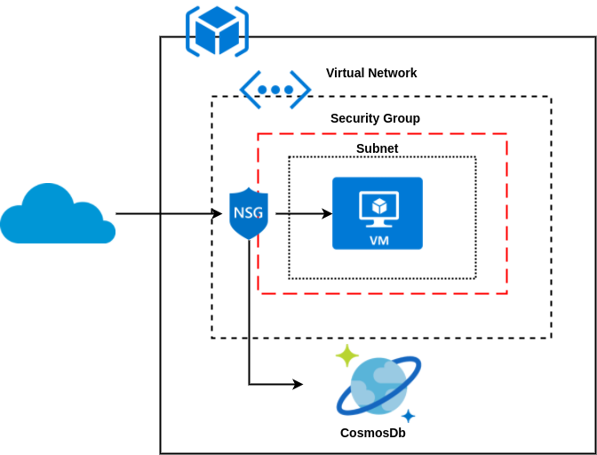

# POC terraform IaaC

## Introduction

The aim of this POC is to implement a specific architecture in differents Clouds with terraform.

This specific architecture is a 2-tier architecture composed with a web server on a public network with internet access. 
And a NoSQL database on private network.

### AWS

In AWS this architecture can be implemented like so:

<p align="center">
  
</p>

The web app is hosted in a AWS EC2 instance contained in AWS Subnet contained in a AWS VPC.
To ensure the security we use AWS Security groups in the webapp subnet. This security group will ensure the role of
firewall and block everything except HTTP, HTTPS, and SSH (for some specific ips).
We use DynamoDB service for the NoSQL database.
The connection between the database and the webapp is possible thanks to the creation of instance's role. This role
give read and write access for a specific DynamoDB table.

### Azure

In Azure this architecture can be implemented like so:

<p align="center">
  
</p>

The web app is hosted in a Azure Virtual Machine contained in Azure Subnet contained in Azure Virtual Network.
To ensure the security we use Azure Security groups in the webapp subnet. This security group will ensure the role of
firewall and block everything except HTTP, HTTPS, and SSH (for some specific ips).
We use CosmoDB service for the NoSQL database.
The connection between the database and the webapp is possible thanks to a https endpoint secure by password 
and filtered by ip (only the web app VM can access to this database throw this endpoint).

## Prerequisites

In order to deploy the infra you need the following tools installed:

 - Git
 - Ansible
 - Terraform

During the Terraform deploying we will use Ansible to provision the web servers. Ansible connect to server through SSH,
so we need to create a ssh key to make possible this connection.

```bash
▶ ssh-keygen -f .ssh-keys/deployer-key -b 4096 -t rsa 
```

### AWS Prerequisites

Terraform need to know the account settings in order to deploy your infra.

So first thing, create a file `terraform/aws/provider.tf` with the following content:

```hcl-terraform
provider "aws" {
  access_key = "XXXXXXXXXXXXXXX"                 # <- Your client_id
  secret_key = "XXXXXXXXXXXXXXXXXXXXXXXXXXXXXXX" # <- Your client_secret
  region     = "${var.aws["region"]}"
}
```

<b>Note:</b> This account need the right in AWS to create service

Finally change in the SSH ip of the `aws_security_group` (line 161) in `terraform/aws/main.tf` with your public ip.

### Azure Prerequisites

Terraform need to know the account settings in order to deploy your infra.

So first thing, create a file `terraform/azure/provider.tf` with the following content:

```hcl-terraform
provider "azure" {
  subscription_id = "XXXXXXXXXXXXXXXXXXXX" # <- Your subscription id
  client_id       = "XXXXXXXXXXXXXXXXXXXX" # <- Your client id
  client_secret   = "XXXXXXXXXXXXXXXXXXXX" # <- Your client secret
  tenant_id       = "XXXXXXXXXXXXXXXXXXXX" # <- Your tenant id
}
```

<b>Note:</b> This account need the right in AWS to create service

Finally change in the SSH ip of the `azurerm_network_security_group` (line 71) in `terraform/azure/main.tf` with your public ip.

## Run

### Run AWS

```bash
▶ cd terraform/aws
▶ terraform apply -auto-approve
```

<b>Note:</b> Deploy take between 2 and 5 minutes

### Run Azure

```bash
▶ az login # Then follow the instruction on terminal

▶ cd terraform/azure
▶ terraform apply -auto-approve
```

<b>Note:</b> Deploy take between 5 and 10 minutes (cosmosdb take a long to create/destroy)
