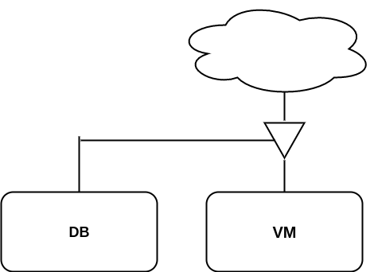
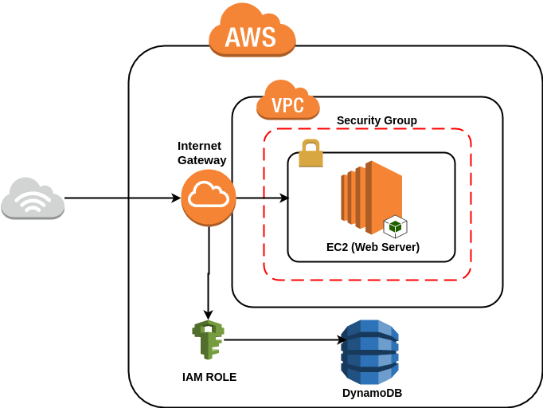

# POC terraform IaaC

## Introduction

The aim of this POC is to implement the following architecture in differents Clouds with terraform.

<p align="center">
  
</p>

This is a 2-tier architecture composed with a webserver on a public network with internet access. And a NoSQL database
on private network.

### AWS

In AWS this architecture can be implemented like so:

<p align="center">
  
</p>

The webapp is hosted in a AWS EC2 contained in AWS Subnet contained in a AWS VPC.
To ensure the security we use AWS Security groups in the webapp subnet. This security group will ensure the role of
firewall and block everything except HTTP, HTTPS, and SSH (for some specific ips).
We use DynamoDB service for the NoSQL database.
The connection between the database and the webapp is possible thanks to the creation of instance's role. This role
give read and write access for a specific DynamoDB table.

### Azure
TODO

## Prerequisites

In order to deploy the infra you need the following tools installed:

 - Git
 - Ansible
 - Terraform

During the Terraform deploying we will use Ansible to provision the web servers. Ansible connect to server through SSH,
so we need to create a ssh key to make possible this connection.

```bash
▶ ssh-keygen -f .ssh-keys/deployer-key -b 4096 -t rsa 
```

### AWS Prerequisites

Terraform need to know the account settings in order to deploy your infra.

So first thing, create a file `~/.aws/credential` with the following content:

    [default]
    XXXXXXXXXXXXXXXXX <- Your client_id
    XXXXXXXXXXXXXXXXXXXXXXXXXXXXXXXXXX <- Your client_secret

<b>Note:</b> This account need the right in AWS to create service

Then open the `terraform/aws/terraform.tfvars` file and change `credentials_file_path` with your credential file's path

Finally change in the SSH ip of the `aws_security_group` (line 166) in `terraform/aws/main.tf` with your public ip.

### Azure Prerequisites
TODO

## Run

### Run AWS

```bash
▶ cd terraform/aws
▶ terraform apply -auto-approve
```

<b>Note:</b> Deploy take between 2 and 5 minutes

### Run Azure

```bash
▶ az login # Then follow the instruction on terminal

▶ cd terraform/azure
▶ terraform apply -auto-approve
```

<b>Note:</b> Deploy take between 5 and 10 minutes (cosmosdb take a long to create/destroy)
